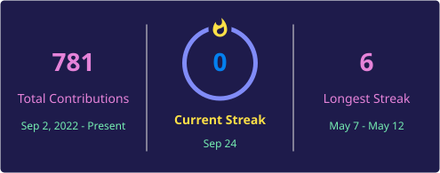

  
  

  
  
  

---

### 👋 About Me

Hi! I'm **Dharmawan Surya Kusuma**, a backend developer from Indonesia specializing in building scalable web applications and cloud infrastructure.

- **Location:** Indonesia
- **Focus:** Backend Development & Cloud Architecture
- **Learning:** React - Cloud Security - DevOps
- **Specialties:** Web Development - Cloud Computing - Database Design
- **Philosophy:** Laravel HOEEKKK

#### 🔭 Currently Working On
Building a **telesales backend system** with Node.js, Prisma ORM, and PostgreSQL - implementing authentication, admin management, and production-ready security features.

#### 🌱 Currently Learning
**React.js** for modern frontend development, **Cloud Security** best practices, and **DevOps automation** with CI/CD pipelines.

---

### 🛠️ Tech Stack

#### Languages

#### Frameworks & Libraries

#### Databases

#### Cloud & DevOps

#### Tools & Platforms

---

### 📊 GitHub Stats

  
  

  

  

---

### 🚀 Featured Projects

<table>
<tr>
<td width="50%" valign="top">

#### Dynamic Bookstore using JSP
Full-stack bookstore with admin panel & shopping cart

**Tech:** `Java` `JSP` `Servlets` `MySQL`

[View Repository →](https://github.com/MawanRequiem/DynamicBookstore-JSP)

</td>
<td width="50%" valign="top">

#### Intraone ISP
ISP subscription management system

**Tech:** `Web Development` `Firebase Realtime Database` `Google Cloud Platform`

[View Repository →](https://github.com/MawanRequiem/Intraone)

</td>
</tr>
<tr>
<td width="50%" valign="top">

#### Intraone Flutter Mobile App
Intraone ISP mobile application, connected with REST API using ExpressJS

**Tech:** `Flutter` `Dart` `REST API` `Express.JS`

[View Repository →](https://github.com/MawanRequiem/Intraone-Flutter)

</td>
<td width="50%" valign="top">

#### Badminton Venue Decision Support System
Decision support system for sports venue selection

**Tech:** `Google Maps API` `Vue.JS` `Express.JS` `Cloud Deployment`

[View Repository →](https://github.com/MawanRequiem/SPK-Pemilihan-GOR)

</td>
</tr>
</table>

---

### 📫 Connect With Me

---

  

